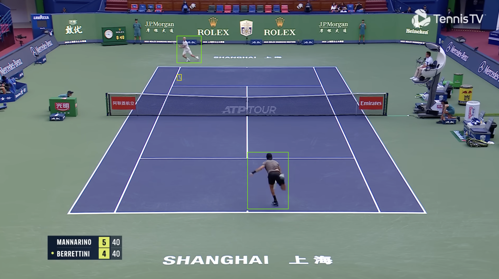
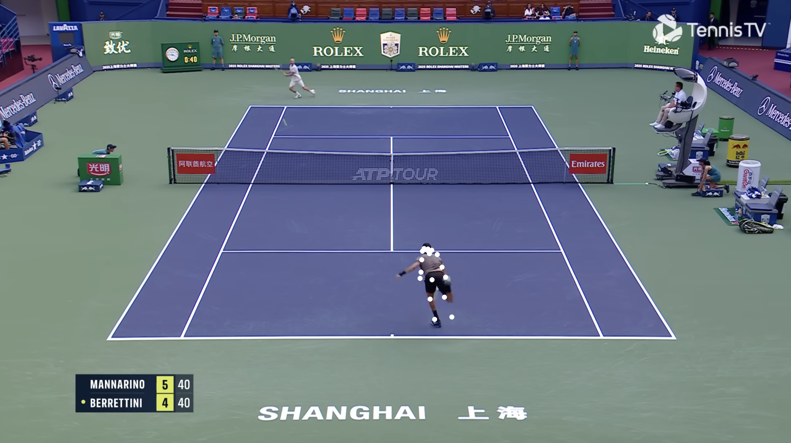
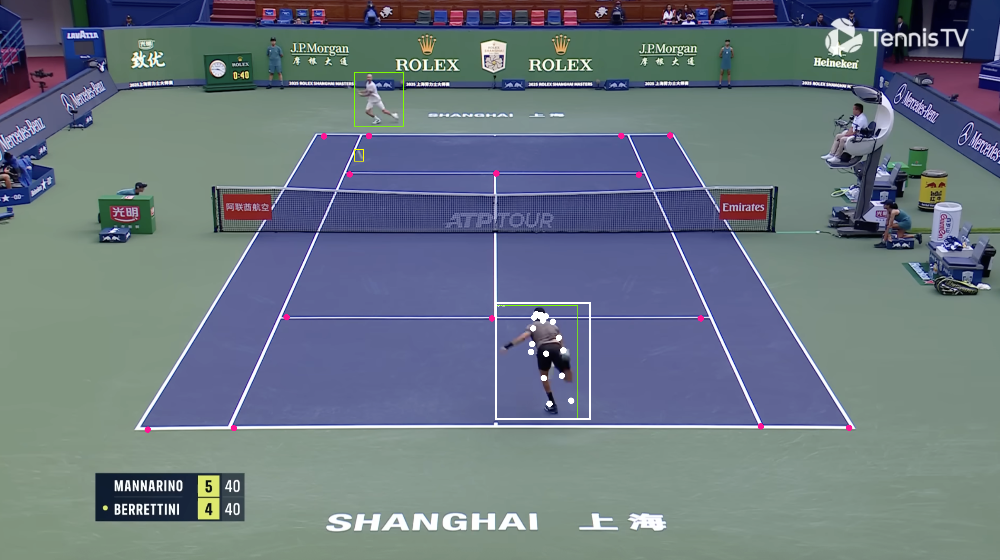

# **Tenis Analysis**

## Image Analysis

Image analysis based on several models taken from Roboflow to identify:
  - Tennis player
  - Tennis ball
  - Shot type
  - Player pose
  - Court keypoints

Two images are provided as an example to test the code which was originally written on Google Colab and for size reasons has not been uploaded as Notebook.
Thus, image paths might need to be updated all along the script.
At the time of testing and running on a CPU the whole script takes 35 seconds to go through 2 images, then image processing takes around 18 seconds each.
While running on a GPU takes 32 seconds to go through the two images, then image processing is reduced to 16 seconds each.

Performance can also be improved by running the model locally with a GPU rather than on Roboflows API.

### Raw image

### Player and ball identification

### Shot identification

### Pose identification

### Court keypoints identification

### Output image

## Video Analysis (WIP)

Video analysis will go one step further and allow for tracking od the different elements of the Image analysis project.

End goal is to provide a detailed analysis of the players performance including:
  - Shot analysis:
      Good / Bad
      Shot type
      Shot location
    
  - Player analysis:
      Player distance
      Pose analysis at the moment of the shot
      Feedback on pose
      Recommendations to improve shots
